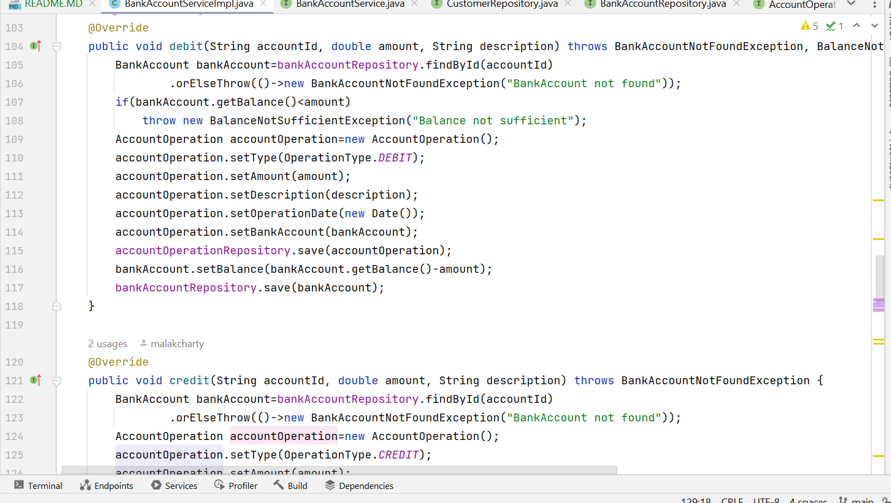

<h2>Projet JEE - Spring Angular JWT</h2>

<h3>Architecture du projet</h3>

<h3>dtos/ — Data Transfer Objects</h3>

Ce package contient toutes les classes DTO (Data Transfer Object) utilisées pour transférer les données entre le backend et le frontend ou pour les traitements métier. 
Chaque DTO reflète une entité mais de façon simplifiée ou enrichie.

<ul>
  <li>CustomerDTO : données d’un client</li>
  
  <li>BankAccountDTO, SavingBankAccountDTO, CurrentBankAccountDTO : représentation des comptes</li>
    
    
    
  <li>AccountOperationDTO, AccountHistoryDTO : opérations bancaires</li>
    
    

  <li>CreditDTO, DebitDTO, TransferRequestDTO : formulaires pour les opérations</li>
    
    
</ul>

<h3>entities/ — Entités JPA</h3>

Contient les entités de base du modèle relationnel, utilisées pour la persistance avec JPA.

<ul>
  <li>Customer : informations du client</li>
    
  <li>BankAccount (classe abstraite)</li>
    
  <li>CurrentAccount : avec découvert</li>
    
  <li>SavingAccount : avec taux d’intérêt</li>
    
  <li>AccountOperation : opérations bancaires (crédit/débit)</li>
    
</ul>
<h3>enums/ — Types énumérés</h3>

Ce dossier contient les énumérations utilisées dans le projet.

<ul>
  <li>AccountStatus : statut d’un compte bancaire</li>
    
  <li>OperationType : CREDIT ou DEBIT</li>
    
</ul>
<h3>exceptions/ — Exceptions personnalisées</h3>

Contient les classes d’exceptions spécifiques levées lors des erreurs métier.

<ul>
  <li>BalanceNotSufficientException</li>
    
  <li>BankAccountNotFoundException</li>
    
  <li>CustomerNotFoundException</li>
    
</ul>
<h3>mappers/ — DTO ↔ Entity</h3>

Utilise MapStruct pour convertir automatiquement les entités vers les DTOs et inversement.

<ul>
  <li>BankAccountMapperImpl</li>
    
    
    
</ul>

<h3>repositories/ — Accès à la base de données</h3>

Contient les interfaces Spring Data JPA pour manipuler les entités.

<ul>
  <li>CustomerRepository</li>
    
  <li>BankAccountRepository</li>
    
  <li>AccountOperationRepository</li>
    
</ul>

<h3>services/ — Couche métier</h3>

Gère la logique métier du projet.

<ul>
  <li>BankAccountService (interface)</li>
    
    
  <li>BankAccountServiceImpl (implémentation)</li>
    
    
    
    
    
    
    

  <li>BankService : logique générale sur les comptes</li>
    

</ul>

<h3>web/ — API REST</h3>

Expose les endpoints REST pour interagir avec les entités via HTTP.

<ul>
  <li>BankAccountRestAPI</li>
    
    

  <li>CustomerRestController</li>
    
</ul>

<h3>EBankingBackendApplication.java</h3>

Point d’entrée principal de l’application Spring Boot avec l’annotation <code>@SpringBootApplication</code>.

    
    
<h3>resources/</h3>

Contient les fichiers de configuration de l’application.

<ul>
  <li><code>application.properties</code> : configuration des ports, de la base de données, des logs, etc.</li>
    
</ul>
<h3>Test de l'API avec Swagger UI/</h3>

Cette capture présente tous les endpoints exposés par le backend :

    
    
<h3>Liste des clients (`GET /customers`)</h3>

Cette capture montre le résultat de la récupération de tous les clients enregistrés :

    
